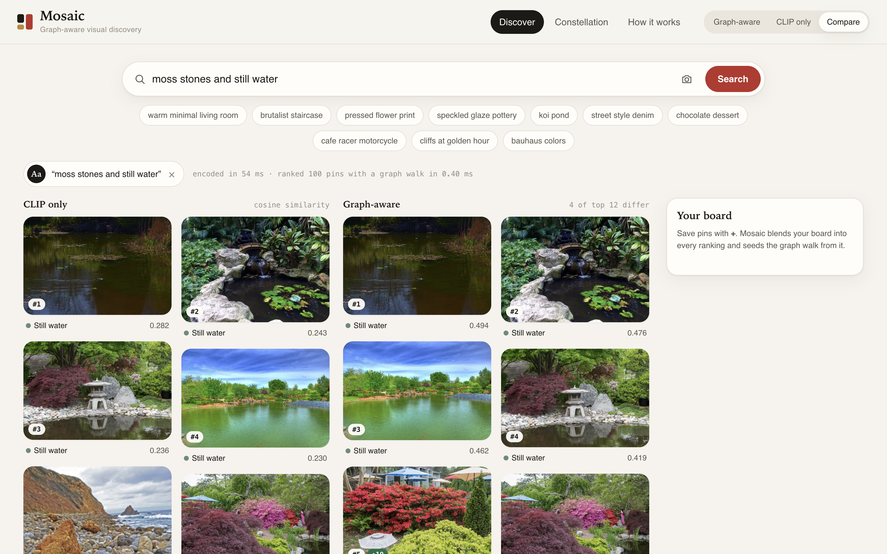

# Mosaic

[](https://github.com/Mohith26/mosaic/actions/workflows/ci.yml)

**Graph-aware visual discovery.** Search a set of images by text, by image, or by drawing a box around one object, and rank the results with a real CLIP model *plus* a pin-board graph. Every ranking can be compared live against CLIP alone.

CLIP knows what an image looks like. A board graph knows what people think belongs together. Pinterest's PinCLIP and PinSage work combines the two at the scale of billions of pins; Mosaic is that idea at a scale where you can inspect each pin, each edge, and each score.

**[Open the demo](https://mohith26.github.io/mosaic/)**. That page is a **static demo**: the 100-image index ships with the page, ranking runs in your browser, and free-text or Lens searches download the CLIP model (~150 MB, once) and run it in the browser too. This repository is the full program: the data pipeline, the indexer, the evaluator, the tests, and a local server.



## Results

Same 100 images, same CLIP vectors. The only difference between the columns is the graph. Generated by `npm run evaluate` into [`results/metrics.json`](results/metrics.json).

**Related pins for a brand-new pin** (100 queries). Each image is queried in turn with its own board membership removed from the graph, so it enters with visual edges only, the way a freshly uploaded pin would. Relevant results are its 9 board-mates.

| Metric | CLIP only | Graph-aware | Change |
|---|---:|---:|---:|
| Recall@10 | 0.698 | **0.839** | +20% |
| Mean average precision | 0.739 | **0.860** | +16% |
| NDCG@10 | 0.748 | **0.857** | +15% |

Paired bootstrap over queries (5,000 resamples): the graph's MAP is higher in 100% of them, 95% CI of the gain [0.1027, 0.1392].

**Text search** (20 hand-written queries in [`eval/queries.json`](eval/queries.json), none of which were used to collect the images).

| Metric | CLIP only | Graph-aware | Change |
|---|---:|---:|---:|
| Precision@10 | 0.730 | **0.895** | +23% |
| Mean average precision | 0.820 | **0.953** | +16% |
| NDCG@10 | 0.799 | **0.925** | +16% |

95% CI of the MAP gain [0.0854, 0.1841].

**The graph weight was fixed at 0.3 before measuring.** The sensitivity sweep in `metrics.json` shows related-pins MAP is flat from 0.2 to 0.6 (0.859 to 0.862), so the result is not a tuned spike. At weight 0 the walk is off but neighbor-fused embeddings remain, which alone lift MAP to 0.830.

**Speed** (Apple Silicon laptop, CPU): ranking all pins with fusion and personalized PageRank takes 0.12 ms p50 / 0.13 ms p95. Encoding a text query with the warm CLIP text tower takes 1.6 ms p50. Embedding an image takes 33 ms.

## How it works

```
 images ──► CLIP ViT-B/16 image tower ──┐
                                        ├─► one 512-d space ──► graph ──► fuse ──► walk ──► rank
 text / crop ─► CLIP text or image tower┘
```

1. **Encode.** `src/clip.mjs` runs OpenAI's CLIP ViT-B/16 (8-bit ONNX, `Xenova/clip-vit-base-patch16`) through Transformers.js. Images, text queries, uploads and Lens crops all land in the same 512-d space.
2. **Connect.** `buildGraph` in `src/graph.mjs` adds two edge types, mirroring the split between content similarity and the pin-board graph: each pin's 6 nearest visual neighbors, and its 4 closest board-mates. 682 edges total (413 visual, 269 board).
3. **Fuse.** Each pin's vector is blended 70/30 with the weighted mean of its neighbors, one parameter-free GraphSAGE-style hop.
4. **Walk.** Personalized PageRank starts from the query's best CLIP matches (or from the selected pin, or from your saved board). Final score = 0.7 x cosine(query, fused vector) + 0.3 x normalized walk score.

The ranking code is plain JavaScript with no dependencies, and the browser imports the exact same `graph.mjs` the evaluator uses, so the demo cannot drift from the measured system.

What the interface does:

- **Discover**: masonry results with rank movement badges (`↑5`, `found by graph · was #31`).
- **Compare**: CLIP-only and graph-aware rankings side by side.
- **Lens**: drag a box around one object in any image, or in an upload, and search with just that region.
- **Your board**: saved pins are blended into the query and seed the graph walk; the board shows which collections it leans toward.
- **Why this result**: CLIP score, walk score, final score, both ranks, and the specific edge the walk flowed through.
- **Constellation**: the whole graph, laid out by classical MDS of the CLIP space refined by a force simulation, with the current results and the edges between them lit up.

## What is real and what is not

- **Real:** the images and their licenses, the CLIP model, every embedding, the graph, the ranking, every metric. Free-text queries are encoded live.
- **Approximated:** the ten “boards” are curated collections assembled by searching Openverse, not real users' boards, and their labels are weak: a few images sit on a board their content does not fit. Pinterest's graph is built from billions of human saves. This is a 100-pin model of the idea, not of Pinterest's system.
- **Not done:** no trained projection head (fusion is parameter-free), no ANN index (at this size exact search is faster), no personalization beyond the board you build in a session.

## Running it

Requires Node 20+.

```sh
npm install
npm run setup     # download images, embed them, build the graph, run the evaluation (~1 min after the first model download)
npm start         # http://127.0.0.1:8790
npm test          # unit tests + API tests, including one against the real model
npm run export    # rebuild the static demo in docs/
```

Individual steps: `npm run fetch` (Openverse API, CC0/PD/CC BY/CC BY-SA only, per-image attribution kept in `data/manifest.json`), `npm run index` (writes `data/index.json`), `npm run evaluate` (writes `results/metrics.json`).

The server is a dependency-free Node HTTP server with two API routes: `GET /api/health` and `POST /api/embed` (`{"text": ...}` or `{"image": dataURL}`, 300-character and 6 MB limits). It only exposes the browser-safe modules under `/lib/` and rejects path traversal; both are covered by tests.

## Layout

```
src/clip.mjs          CLIP encoders (Transformers.js)
src/graph.mjs         similarity matrix, graph, fusion, personalized PageRank, scoring, layout
src/metrics.mjs       recall, precision, AP, NDCG, paired bootstrap
scripts/              fetch-dataset, build-index, evaluate, export-static
server.mjs            local server
public/               the interface
eval/queries.json     held-out text queries
results/metrics.json  measured results
docs/                 static demo (GitHub Pages)
```

## Credits

Images from [Openverse](https://openverse.org/); each image's creator, license and source page are in `data/manifest.json` and in the demo's detail panel. Model: OpenAI CLIP via [Xenova/clip-vit-base-patch16](https://huggingface.co/Xenova/clip-vit-base-patch16). Inspired by Pinterest's PinCLIP (2026), PinSage (2018) and Unified Visual Embeddings (2019) papers. Code is MIT licensed.
